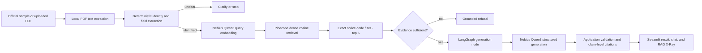

# NoticeLens

> **Understand the IRS notice in front of you — with evidence.**

*Turn a confusing IRS notice into a clear, source-backed explanation.*

NoticeLens identifies the notice, retrieves the matching official IRS guidance, and binds every material guidance claim to evidence the application can display and verify.

NoticeLens is an educational document-intelligence project, **not a tax advisor**. It does not provide personalized tax or legal advice.

## Product overview

The Streamlit application provides three focused views:

1. **Analyze Notice** — choose one of eight official IRS samples or upload a PDF, then inspect the identified notice, confidently extracted fields, explanation, and official evidence.
2. **Ask NoticeLens** — ask follow-up questions about the active notice through the same evidence-grounded RAG core. There is no retrieval-bypassing chat path.
3. **RAG X-Ray** — inspect the frozen configuration, retrieved chunks, similarity scores, experiment results, and quality metrics.

The interface reports one of three evidence states: **Grounded**, **Insufficient Evidence**, or **Notice Identity Unclear**. Missing dates, amounts, deadlines, and reference numbers are shown as not confidently identified rather than guessed.

## The problem

IRS notices combine taxpayer-specific facts with procedural language and notice-family distinctions that are easy to confuse. A generic model may answer from stale outside knowledge, mix up adjacent notices, or invent a deadline or source. NoticeLens separates the task into controlled stages:

- extract only explicit facts from the notice;
- establish notice identity before retrieval;
- restrict retrieval to that notice's official guidance;
- generate only from the retrieved evidence and permitted notice fields;
- expose the supporting IRS source for each material guidance claim.

## Why RAG

Retrieval-augmented generation keeps the answer tied to the frozen IRS corpus instead of treating model memory as authority. It also makes failure explicit: if the notice cannot be identified, evidence is missing, or a requested fact is unsupported, the graph stops or refuses instead of fabricating an answer.

## Architecture



The production LangGraph is deliberately small:

```text
START → identify_notice
  ├─ unidentified / ambiguous → clarify_or_fail → END
  └─ identified → retrieve_guidance
       ├─ insufficient / unsupported → refuse → END
       └─ sufficient → generate_grounded_answer → END
```

There is no retrieval router, query rewriting, per-chunk grading loop, or alternate RAG implementation in the UI.

## Technology stack

- **Python 3.11** — application and evaluation runtime
- **LangChain** — document objects, token-aware chunk processing, embedding adapter, and retrieval integration
- **LangGraph** — stateful notice-identification, retrieval, refusal, and generation workflow
- **Nebius Token Factory** — Qwen3 embeddings and grounded structured generation
- **Pinecone** — dense vector storage and notice-filtered cosine retrieval
- **Streamlit** — user-facing analysis, Week 2 chatbot UI bonus, and technical-inspection UI
- **Jupyter** — reproducible retrieval and evaluation lab

No Mem0, LlamaIndex, Lyzr, ElevenLabs, authentication layer, or database is part of the project.

## Corpus

The frozen evidence corpus contains **50 official IRS notice-guidance documents**. It covers balance collection, installment agreements, underreporter and deficiency notices, non-filer notices, identity and refund verification, and other common notice families.

Eight official sample notice PDFs are available for the product demo. They are kept under [`data/raw/sample_notices/`](data/raw/sample_notices/) and are intentionally excluded from the permanent guidance index. Source inventory is controlled by [`data/corpus_manifest.csv`](data/corpus_manifest.csv) and [`data/sample_notice_manifest.csv`](data/sample_notice_manifest.csv).

## Ingestion and cleaning

Acquisition reads only the manifest-approved IRS URLs. The cleaner extracts the IRS article body while excluding global navigation, search, side navigation, and footer content. It preserves headings, paragraphs, lists, tables, and source URLs, then applies reconciliation, minimum-content, duplicate, and mandatory-family gates.

The frozen Phase 1 result successfully downloaded and cleaned all 50 guidance pages, preserved all 1,029 source list items, found no duplicate cleaned documents, and reconciled every expected artifact. Processed guidance lives under [`data/processed/guidance/`](data/processed/guidance/).

Notice PDFs use their existing text layer. OCR is not implemented. Encrypted, invalid, oversized, textless, and over-page-limit PDFs fail safely.

## Chunking experiment: fixed vs. heading-aware

The first dense baseline used fixed 220-token chunks with 40-token overlap. It achieved perfect notice-level retrieval, but fixed windows could cross section boundaries. The production strategy preserves heading paths and applies 220/40 splitting only inside oversized sections, yielding 580 heading-aware chunks.

| Retrieval evaluation | Precision@1 | MRR | Hit@5 |
|---|---:|---:|---:|
| Notice-level dense | **100.00%** | **1.00000** | **100.00%** |
| Fixed-size section retrieval | 80.00% | 0.86889 | 100.00% |
| Heading-aware section retrieval | **93.33%** | **0.95556** | **100.00%** |

Heading-aware chunking improved Section Precision@1 by **+13.33 absolute percentage points**, exceeding the precommitted improvement threshold.

## Embeddings and vector retrieval

Nebius Token Factory serves `Qwen/Qwen3-Embedding-8B` embeddings at **4,096 dimensions**. Pinecone stores the vectors in the `noticelens-rag` index and the frozen `heading-aware-dense` production namespace.

The production retriever uses:

- heading-aware chunks;
- dense cosine similarity;
- exact deterministic `notice_code` filtering;
- `top_k = 5`;
- no BM25, fusion, reranking, query rewriting, or retrieval router.

Runtime retrieval is read-only. The application verifies the frozen artifacts and expected namespace before querying.

## LangChain and LangGraph roles

LangChain provides the document contract that carries chunk text and application-owned metadata such as notice code, title, heading path, source URL, and chunk ID. It also provides the embedding interface used by the Nebius adapter and supports the chunk-processing/retrieval pipeline.

LangGraph owns control flow. Its deterministic gates ensure that unclear identity, unsupported requests, and insufficient evidence cannot fall through to ordinary generation. This separation keeps the UI thin: `app.py` invokes the production core under [`src/noticelens/`](src/noticelens/) instead of implementing a second RAG pipeline.

## Generation

Grounded answers use `Qwen/Qwen3-30B-A3B-Instruct-2507` through Nebius Token Factory. The model receives the question, selected redacted notice context, permitted deterministically extracted fields, and the five retrieved IRS evidence chunks. Structured output is validated before anything is rendered.

The selected model achieved the required grounding and refusal gates while preserving materially better answer coverage than the faster candidates. It did **not** meet the latency target.

## Claim-level citations

Citation provenance is controlled by the application, not the model. A generated guidance claim is accepted only when it names a retrieved chunk and supplies an evidence excerpt contained in that chunk. Notice-specific claims can use only explicit, relevant extracted fields and their source text.

For each material guidance claim, the UI can expose:

- IRS notice code;
- official source title;
- heading and heading path;
- evidence excerpt;
- official IRS source URL.

The model cannot invent or override source URLs, headings, chunk IDs, or citation metadata.

## Refusal behavior

NoticeLens stops before retrieval when notice identity is missing or ambiguous. It refuses when evidence is unavailable, metadata is invalid, the request is categorically unsupported, or the structured output fails grounding validation. The standard evidence refusal is:

> I couldn't verify that from the available IRS guidance.

The frozen refusal benchmark scored **4/4 (100%)**.

## Retrieval ablation

BM25, reciprocal-rank fusion, and hosted reranking were tested over the exact same 580 chunks, 15 section questions, notice-code restriction, top five, and scoring rules.

| Heading-aware variant | Section P@1 | MRR | Hit@5 | Median retrieval | p95 retrieval |
|---|---:|---:|---:|---:|---:|
| Dense | **93.33%** | 0.95556 | 100.00% | 0.097893s | 0.246287s |
| BM25 | 40.00% | 0.61556 | 100.00% | 0.000094s | 0.000229s |
| Hybrid RRF | 66.67% | 0.83333 | 100.00% | 0.098132s | 0.246513s |
| Hybrid + reranker | **93.33%** | **0.96667** | 100.00% | 0.315216s | 0.506594s |

The reranker fixed the dense system's S06 failure but introduced a rank-one regression on S11, leaving P@1 unchanged. None of the more complex variants met the precommitted production decision rule, so **heading-aware dense retrieval remains the final production retriever**. This experiment does not establish that one technique is universally better.

Additional retrieval complexity was tested rather than assumed. Heading-aware dense retrieval was retained because BM25, hybrid retrieval and reranking did not produce a meaningful Precision@1 gain on the frozen benchmark.

See the complete paired results in [`reports/retrieval_ablation.md`](reports/retrieval_ablation.md).

## Jupyter RAG Experiment Lab

[`notebooks/noticelens_rag_lab.ipynb`](notebooks/noticelens_rag_lab.ipynb) presents the frozen Phase 3, 4A, 4B, 5, 5.1, and retrieval-ablation results, including rendered tables and a comparison chart. It reads saved local artifacts and makes no Nebius or Pinecone API calls.

Install the optional notebook dependencies with:

```powershell
python -m pip install -e ".[notebook]"
```

## Evaluation

The evaluation plan and questions were frozen before result inspection. Retrieval was measured at both notice and section level, followed by formal claim-level faithfulness, unsupported-question refusal, structured-output reliability, answer coverage, and live latency evaluation.

| Final quality gate | Result |
|---|---:|
| Dense notice Precision@1 | **100.00% (22/22)** |
| Dense notice MRR / Hit@5 | **1.000 / 100.00%** |
| Fixed section Precision@1 | **80.00%** |
| Heading-aware section Precision@1 | **93.33%** |
| Formal faithfulness | **100.00% (23/23 factual claims)** |
| Correct refusal | **100.00% (4/4)** |
| Warm end-to-end median | **9.775s** |
| Warm end-to-end p95 | **22.050s** |
| Latency target | **<6s — NOT MET** |

Faithfulness measures whether evaluated factual claims are fully supported by the supplied evidence. It does not establish answer completeness, tax correctness outside that evidence, or suitability for an individual taxpayer's situation. Full frozen reports are available under [`reports/`](reports/).

## Latency limitation

The final system's measured warm end-to-end median was **9.775 seconds** and p95 was **22.050 seconds**, so the precommitted `<6s` p95 target was not met. Generation dominates response time. The UI uses real status/spinner states so users can see that work is continuing; it does not fabricate progress or hide the measured limitation.

Provider availability and network conditions can also affect a live request. Pinecone, Nebius, PDF, identity, evidence, and generation failures are converted into user-safe states rather than raw provider errors or Python tracebacks.

## Privacy and security limitations

IRS notices can contain highly sensitive information. For this project demo, use the bundled official samples or an appropriately redacted notice.

- Uploaded PDFs are not intentionally stored permanently by the application.
- PDF parsing, notice identification, and deterministic field extraction run locally.
- Selected, query-relevant notice excerpts pass through limited redaction, and only question-relevant deterministic fields are included before generation. This heuristic PII minimization is **not comprehensive PII protection**.
- The user's question is sent to Nebius for embedding and generation; selected notice context and retrieved evidence are sent to Nebius for generation. Query vectors and the notice-code filter are sent to Pinecone for retrieval.
- The project has no authentication, access-control layer, audit store, or compliance certification.
- Do not deploy the demo for real taxpayer data without a separate privacy, security, retention, provider-contract, and threat-model review.

API credentials must never be committed, displayed in the UI, printed in logs, or placed in notebook outputs.

## Local setup

Requirements:

- Python 3.11
- access to the existing Nebius Token Factory and Pinecone resources
- the external credential file described below

From the project root:

```powershell
python -m venv .venv
.\.venv\Scripts\Activate.ps1
python -m pip install --upgrade pip
python -m pip install -e .
```

For local development, credentials are loaded only from:

```text
C:/Users/donur/.noticelens.env
```

That external file must provide `NEBIUS_API_KEY` and `PINECONE_API_KEY`. Do not copy it into the repository, create a project-local `.env`, or expose either value. Application code accesses only those environment-variable names after the explicit external load.

Run the offline test suite:

```powershell
python -B -m unittest discover -s tests -v
```

## How to run

Launch the Streamlit app from the project root:

```powershell
python -m streamlit run app.py
```

Then open the local URL reported by Streamlit. Start with an official sample, select **Analyze Notice**, inspect the grounded result and citations, ask a follow-up in **Ask NoticeLens**, and inspect the retrieval trace in **RAG X-Ray**.

The live app calls Nebius and performs read-only Pinecone queries. Initial model verification and subsequent generation can take longer than the measured median, so keep the terminal running while the status indicator is active.

## Project structure

The roles are deliberately separated:

- `src/noticelens/` = production implementation.
- `notebooks/noticelens_rag_lab.ipynb` = experiment / analysis artifact.
- `reports/` = frozen evaluation evidence.

```text
NoticeLens/
├── app.py                         # Streamlit product UI
├── src/noticelens/               # frozen RAG, retrieval, graph, and evaluation modules
├── data/
│   ├── corpus_manifest.csv        # authoritative 50-document guidance inventory
│   ├── sample_notice_manifest.csv # authoritative eight-sample inventory
│   ├── processed/guidance/        # cleaned official IRS evidence corpus
│   ├── raw/sample_notices/        # demo PDFs; never indexed as guidance
│   └── derived/                   # frozen fixed and heading-aware chunk registries
├── eval/                          # frozen notice and section benchmark questions
├── notebooks/
│   └── noticelens_rag_lab.ipynb   # executed offline experiment lab
├── reports/                       # evaluation outputs and production configuration
├── scripts/                       # reproducible phase and ablation runners
├── tests/                         # offline unit and integration tests
└── pyproject.toml                 # production and optional notebook dependencies
```

## Week 2 learnings

- **Measure before adding complexity.** Perfect notice-level dense retrieval made an elaborate notice router unnecessary.
- **Structure can matter more than retrieval variety.** Respecting IRS heading boundaries improved Section P@1 by 13.33 points; BM25 and hybrid fusion did not.
- **A higher secondary metric is not enough.** Reranking increased MRR but did not improve P@1 and moved the remaining failure from S06 to S11.
- **Citations need application ownership.** Validating evidence excerpts and attaching source metadata outside the model prevents invented source URLs from reaching the UI.
- **Refusal is part of the product.** Identity and evidence gates are explicit workflow states, not prompt suggestions.
- **Latency is an end-to-end quality metric.** The final model met grounding gates but missed the `<6s` target, so the limitation is visible in both the app and this README.
- **Privacy claims must match the implementation.** Local extraction and context minimization reduce exposure, but they do not make an uploaded tax notice risk-free.

NoticeLens is feature-complete at the Streamlit UI stage. The production RAG configuration and frozen experimental results should not be changed without a new, separately approved evaluation.
